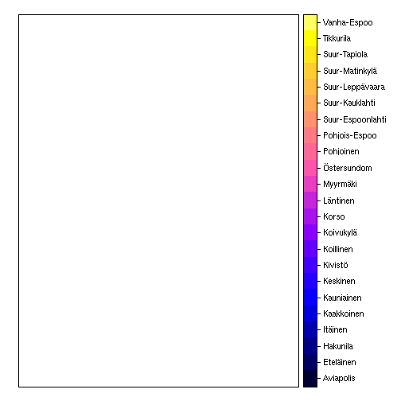
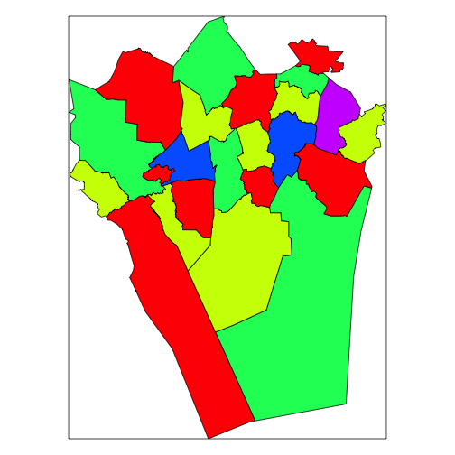
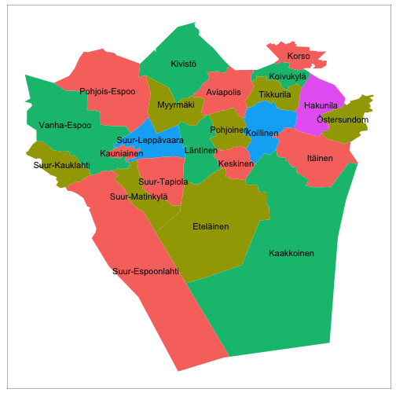
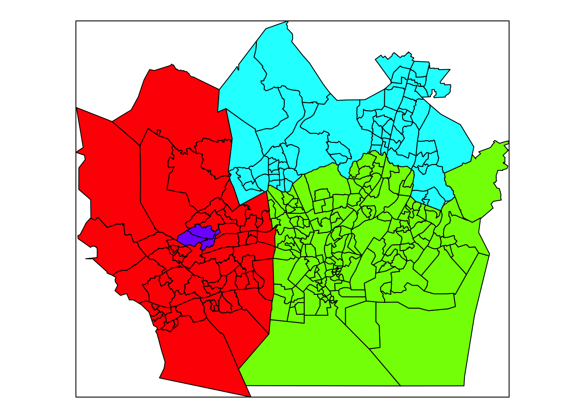
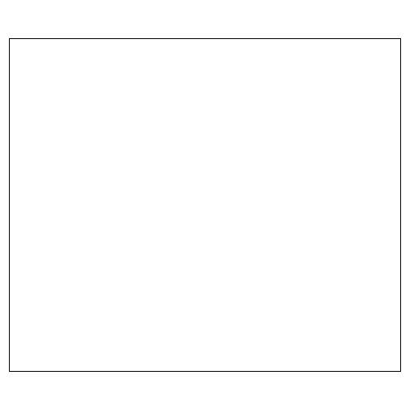

<!--
%\VignetteEngine{knitr}
%\VignetteIndexEntry{An R Markdown Vignette made with knitr}
-->


# gisfin - tutorial

This R package provides tools to access open spatial data in Finland
as part of the [rOpenGov](http://ropengov.github.io) project.

For contact information and source code, see the 
[github page](https://github.com/rOpenGov/gisfin)

## Available data sources

[Helsinki region district maps](#aluejakokartat) (Helsingin seudun 
aluejakokartat)

+ Aluejakokartat: kunta, pien-, suur-, tilastoalueet (Helsinki region district 
maps)
+ Äänestysaluejako: (Helsinki region election district maps)
+ Source: [Helsingin kaupungin Kiinteistövirasto (HKK)](http://ptp.hel.fi/avoindata/)

[Helsinki spatial data](#hel-spatial) (Helsingin seudun avoimia 
paikkatietoaineistoja)

+ Seutukartta (Helsinki Region Maps)
+ Helsingin piirijako (District Division of the City of Helsinki)
+ Seudullinen osoiteluettelo (Regional Address List)
+ Helsingin osoiteluettelo (Register of Addresses of the City of Helsinki)
+ Rakennusrekisterin ote (Helsinki building registry)
+ Source: [Helsingin kaupungin Kiinteistövirasto (HKK)](http://ptp.hel.fi/avoindata/)

[National Land Survey data](#maanmittauslaitos) (Maanmittauslaitoksen avointa 
dataa)

+ Yleiskartat: kunta-, maakuntarajat (municipality and province borders)
+ Source: [Maanmittauslaitos (MML)](http://www.maanmittauslaitos.fi/avoindata)

[Geocoding](#geocoding)

+ [OKF.fi Geocoding API Test Console](http://data.okf.fi/console/)
+ [OpenStreetMap Nominatim](http://wiki.openstreetmap.org/wiki/Nominatim_usage_policy)
+ [Google](http://code.google.com/apis/maps/documentation/geocoding/)

[IP address geographic coordinates](#ip) 

+ [Data Science Toolkit](http://www.datasciencetoolkit.org/)

[Statistics Finland geospatial data](#geostatfi) (Tilastokeskuksen paikkatietoaineistoja)

+ Väestöruutuaineisto (Population grid)
+ Tuotanto- ja teollisuuslaitokset (Production and industrial facilities)
+ Oppilaitokset (Educational institutions)
+ Tieliikenneonnettomuudet (Road accidents)
+ Source: [Statistics Finland](http://www.stat.fi/tup/rajapintapalvelut/index_en.html)

[Finnish postal code areas](#pnro) (Suomalaiset postinumero KML-muodossa)

+ Source: [Duukkis](http://www.palomaki.info/apps/pnro/)

[Examples](#examples) (Further usage examples)

List of potential data sources to be added to the package can be found 
[here](https://github.com/rOpenGov/gisfin/blob/master/vignettes/todo-datasets.md).

## Installation

### Requirements

The gisfin package uses the 
[rgdal](http://cran.r-project.org/web/packages/rgdal/index.html) package, which 
depends on [GDAL](http://www.gdal.org/) (Geospatial Data Abstraction Library).
Some rgdal installation tips for various platforms are listed below. The
gisfin package has been tested with recent versions of the dependency packages
and libraries and it is recommended to use the recent releases. The older versions
are known to cause problems in some cases. If you encounter problems, please contact
us by email: louhos@googlegroups.com.

#### Windows

Install binaries from [CRAN](http://cran.r-project.org/web/packages/rgdal/index.html)

#### OSX

Follow [these instructions](http://tlocoh.r-forge.r-project.org/mac_rgeos_rgdal.html) to install rgeos and rgdal on OSX. If these don't work, install the rgdal from [KyngChaos Wiki](http://www.kyngchaos.com/software/frameworks).This is preferred over using the [CRAN binaries](http://cran.r-project.org/web/packages/rgdal/index.html).

#### Linux 

Install the following packages through your distribution's package manager

__Ubuntu/Debian__

```
sudo apt-get -y install libgdal1-dev libproj-dev
```

__Fedora__

```
sudo yum -y install gdal-devel proj-devel
```

__openSUSE__

```
sudo zypper --non-interactive in libgdal-devel libproj-devel
```

### Additional dependencies

These may be needed:
  <a href="http://trac.osgeo.org/gdal/wiki/DownloadSource">GDAL</a>, 
  <a href="http://freeglut.sourceforge.net/">freeglut</a>, 
  <a href="http://xmlsoft.org/downloads.html">XML</a>, 
	<a href="http://trac.osgeo.org/geos">GEOS</a> and
	<a href="http://trac.osgeo.org/proj">PROJ.4</a>.

### Installing the package

Development version for developers:


```r
install.packages("devtools")
library("devtools")
install_github("ropengov/gisfin")
```

Load package.


```r
library("gisfin")
```

----

## <a name="aluejakokartat"></a>Helsinki region district maps

Helsinki region district maps (Helsingin seudun aluejakokartat) from 
[Helsingin kaupungin Kiinteistövirasto (HKK)](http://ptp.hel.fi/avoindata/).

List available maps with `get_helsinki_aluejakokartat()`.


```r
get_helsinki_aluejakokartat()
```

```
## [1] "kunta"             "pienalue"          "pienalue_piste"   
## [4] "suuralue"          "suuralue_piste"    "tilastoalue"      
## [7] "tilastoalue_piste" "aanestysalue"
```

Below the 'suuralue' districts is used for plotting examples with `spplot()` and 
[ggplot2](http://ggplot2.org/). The other district types can be plotted 
similarly.

### Plot with spplot

Retrieve 'suuralue' spatial object with `get_helsinki_aluejakokartat()` and plot 
with `spplot()`.


```r
sp.suuralue <- get_helsinki_aluejakokartat(map.specifier="suuralue")
spplot(sp.suuralue, zcol="Name")
```



Function `generate_map_colours()` allows nice region colouring separable 
adjacent regions. This is used here with the `rainbow()` colour scale to plot 
the regions with `spplot()`.


```r
sp.suuralue@data$COL <- factor(generate_map_colours(sp=sp.suuralue))
spplot(sp.suuralue, zcol="COL", 
       col.regions=rainbow(length(levels(sp.suuralue@data$COL))), 
       colorkey=FALSE)
```



### Plot with ggplot2

Use the 'sp.suuralue' retrieved above, and retrieve also the center points of 
the districts. Use `sp2df()` function to tranform the spatial objects into data 
frames. Plot with [ggplot2](http://ggplot2.org/), using blank map theme with 
`get_theme_map()`. 


```r
# Retrieve center points
sp.suuralue.piste <- get_helsinki_aluejakokartat(map.specifier="suuralue_piste")
# Get data frames
df.suuralue <- sp2df(sp.suuralue)
df.suuralue.piste <- sp2df(sp.suuralue.piste)
# Set map theme
library(ggplot2)
theme_set(get_theme_map())
# Plot regions, add labels using the points data
ggplot(df.suuralue, aes(x=long, y=lat)) + 
  geom_polygon(aes(fill=COL, group=Name)) + 
  geom_text(data=df.suuralue.piste, aes(label=Name)) + 
  theme(legend.position="none")
```



### Plot election districts

Retrieve and plot äänetysaluejako (election districts) with 
`get_helsinki_aluejakokartat()` and `spplot()`, use colours to separate 
municipalities.


```r
sp.aanestys <- get_helsinki_aluejakokartat(map.specifier="aanestysalue")
spplot(sp.aanestys, zcol="KUNTA", 
       col.regions=rainbow(length(levels(sp.aanestys@data$KUNTA))), 
       colorkey=FALSE)
```



----

## <a name="hel-spatial"></a>Helsinki spatial data

Other Helsinki region spatial data from 
[Helsingin Kaupungin Kiinteistövirasto (HKK)](http://ptp.hel.fi/avoindata/).

List available spatial data with `get_helsinki_spatial()`.


```r
get_helsinki_spatial()
```

Retrieve municipality map for the larger Helsinki region with 
`get_helsinki_spatial()` and transform coordinates with `sp::spTransform()`.


```r
sp.piiri <- get_helsinki_spatial(map.type="piirijako", 
                                 map.specifier="ALUEJAKO_PERUSPIIRI")
```

```
## Error in utils::download.file(remote.zip, destfile = local.zip, quiet = !verbose): cannot open URL 'http://ptp.hel.fi/avoindata/Helsingin_piirijako_2013.zip'
```

```r
# Check current coordinates
sp.piiri@proj4string
```

```
## Error in eval(expr, envir, enclos): object 'sp.piiri' not found
```

```r
# Transform coordinates to WGS84
sp.piiri <- sp::spTransform(sp.piiri, CRS("+proj=longlat +datum=WGS84"))
```

```
## Error in sp::spTransform(sp.piiri, CRS("+proj=longlat +datum=WGS84")): object 'sp.piiri' not found
```

----

## <a name="maanmittauslaitos"></a>National Land Survey Finland

Spatial data from [National Land Survey Finland](http://www.maanmittauslaitos.fi/en/opendata) 
(Maanmittauslaitos, MML). These data are preprocessed into RData format, see 
details [here](https://github.com/avoindata/mml).


Retrieve regional borders for Finland with `get_mml()`.


```r
# Get a specific map
sp.mml <- get_mml(map.id="Yleiskartta-4500", data.id="HallintoAlue")
# Investigate available variables in this map
library(knitr)
kable(head(as.data.frame(sp.mml)))
```


|    | Kohderyhma| Kohdeluokk| Enklaavi|AVI |Maakunta |Kunta |AVI_ni1                                   |AVI_ni2                                            |Maaku_ni1         |Maaku_ni2           |Kunta_ni1 |Kunta_ni2 |Kieli_ni1 |Kieli_ni2 |AVI.FI                                    |Kieli.FI |Maakunta.FI       |Kunta.FI |
|:---|----------:|----------:|--------:|:---|:--------|:-----|:-----------------------------------------|:--------------------------------------------------|:-----------------|:-------------------|:---------|:---------|:---------|:---------|:-----------------------------------------|:--------|:-----------------|:--------|
|005 |         71|      84200|        1|4   |14       |005   |Länsi- ja Sisä-Suomen aluehallintovirasto |Regionförvaltningsverket i Västra och Inre Finland |Etelä-Pohjanmaa   |Södra Österbotten   |Alajärvi  |N_A       |Suomi     |N_A       |Länsi- ja Sisä-Suomen aluehallintovirasto |Suomi    |Etelä-Pohjanmaa  |NA       |
|009 |         71|      84200|        1|5   |17       |009   |Pohjois-Suomen aluehallintovirasto        |Regionförvaltningsverket i Norra Finland           |Pohjois-Pohjanmaa |Norra Österbotten   |Alavieska |N_A       |Suomi     |N_A       |Pohjois-Suomen aluehallintovirasto        |Suomi    |Pohjois-Pohjanmaa |NA       |
|010 |         71|      84200|        1|4   |14       |010   |Länsi- ja Sisä-Suomen aluehallintovirasto |Regionförvaltningsverket i Västra och Inre Finland |Etelä-Pohjanmaa   |Södra Österbotten   |Alavus    |N_A       |Suomi     |N_A       |Länsi- ja Sisä-Suomen aluehallintovirasto |Suomi    |Etelä-Pohjanmaa  |NA       |
|016 |         71|      84200|        1|1   |07       |016   |Etelä-Suomen aluehallintovirasto          |Regionförvaltningsverket i Södra Finland           |Päijät-Häme       |Päijänne-Tavastland |Asikkala  |N_A       |Suomi     |N_A       |Etelä-Suomen aluehallintovirasto          |Suomi    |Päijät-Häme    |NA       |
|018 |         71|      84200|        1|1   |01       |018   |Etelä-Suomen aluehallintovirasto          |Regionförvaltningsverket i Södra Finland           |Uusimaa           |Nyland              |Askola    |N_A       |Suomi     |N_A       |Etelä-Suomen aluehallintovirasto          |Suomi    |Uusimaa           |NA       |
|019 |         71|      84200|        1|2   |02       |019   |Lounais-Suomen aluehallintovirasto        |Regionförvaltningsverket i Sydvästra Finland       |Varsinais-Suomi   |Egentliga Finland   |Aura      |N_A       |Suomi     |N_A       |Lounais-Suomen aluehallintovirasto        |Suomi    |Varsinais-Suomi   |NA       |

You can list other available data sets: 


```r
list_mml_datasets()
```

```
## Error in list_mml_datasets(): could not find function "list_mml_datasets"
```


## <a name="examples"></a>Further examples

### Visualizing Finnish municipalities with your own data

Here we show examples with the standard shape tools. For interactive maps, see [leaflet](https://rstudio.github.io/leaflet/map_widget.html) and [rMaps](http://rmaps.github.io/). Examples to be added later.


First, retrieve population data (2013) for Finnish municipalities:


```r
# Get municipality population data from Statistics Finland
# using the pxweb package
library(pxweb)
mydata <- get_pxweb_data(url = "http://pxwebapi2.stat.fi/PXWeb/api/v1/fi/Kuntien_talous_ja_toiminta/Kunnat/ktt14/080_ktt14_2013_fi.px",
             dims = list(Alue = c('*'),
                         Tunnusluku = c('30'),
                         Vuosi = c('Arvo')),
             clean = TRUE)
```

```
## Error: No internet connection to http://pxwebapi2.stat.fi/PXWeb/api/v1/fi/Kuntien_talous_ja_toiminta/Kunnat/ktt14/080_ktt14_2013_fi.px
```

```r
# Pick municipality ID from the text field
mydata$Kuntakoodi <- sapply(strsplit(as.character(mydata$Alue), " "), function (x) x[[1]])
```

```
## Error in strsplit(as.character(mydata$Alue), " "): object 'mydata' not found
```

```r
mydata$Kunta <- sapply(strsplit(as.character(mydata$Alue), " "), function (x) x[[2]])
```

```
## Error in strsplit(as.character(mydata$Alue), " "): object 'mydata' not found
```

```r
# Rename fields for clarity
mydata$Asukasluku <- mydata$values
```

```
## Error in eval(expr, envir, enclos): object 'mydata' not found
```

```r
# Pick only the necessary fields for clarity
mydata <- mydata[, c("Kunta", "Kuntakoodi", "Asukasluku")]
```

```
## Error in eval(expr, envir, enclos): object 'mydata' not found
```


Visualize population with Land Survey Finland (MML) maps. See also [blog post on this topic](http://louhos.github.io/news/2015/06/06/kuntakartat/). Use a fast wrapper that generates ggplot2-object that can be further modified if necessary:


```r
# Get the municipality map for visualization
sp <- get_municipality_map(data.source = "MML")

# Merge the Finnish map shape file and the population data based on
# the 'Kunta' field. The population data contains also some other
# regions besides municipalities. These will be ignored when merged
# with the municipality map:
sp2 <- sp::merge(sp, mydata, all.x = TRUE, by.x = "kuntakoodi", by.y="Kuntakoodi")
```

```
## Error in sp::merge(sp, mydata, all.x = TRUE, by.x = "kuntakoodi", by.y = "Kuntakoodi"): object 'mydata' not found
```

```r
p <- region_plot(sp2, color = "Asukasluku", region = "kuntakoodi", by = 100000)
```

```
## Error in message("Transforming ", class(sp), " into a data frame"): object 'sp2' not found
```

```r
print(p)
```

```
## Error in print(p): object 'p' not found
```

### Using GADM maps

Same with GADM maps. You can select the desired maps at the [GADM service](http://gadm.org/country). Choose Finland and file format R. This will give the [link to the Finnish municipality data file](http://biogeo.ucdavis.edu/data/gadm2/R/FIN_adm4.RData). GADM contains very useful maps but the Finnish municipality map data seems a bit outdated:


```r
# Load municipality borders from GADM:
# sp <- get_municipality_map(data.source = "GADM") # also possible
gadm.url <- "http://biogeo.ucdavis.edu/data/gadm2/R/FIN_adm4.RData"
con <- url(gadm.url)
load(con); close(con)
```

```
## Error in load(con): cannot open the connection to 'http://biogeo.ucdavis.edu/data/gadm2/R/FIN_adm4.RData'
```

```r
# Convert NAME field into factor (needed for plots)
gadm$NAME_4 <- factor(gadm$NAME_4)
```

```
## Error in factor(gadm$NAME_4): object 'gadm' not found
```

```r
# Merge the Finnish map shape file and the population data based on
# the 'Kunta' field (see above)
gadm2 <- sp::merge(gadm, mydata, by.x = "NAME_4", by.y = "Kunta", all.x = TRUE)
```

```
## Error in sp::merge(gadm, mydata, by.x = "NAME_4", by.y = "Kunta", all.x = TRUE): object 'gadm' not found
```

```r
# Plot the shape file, colour municipalities by population
# It turns out that not all municipality names can be matched.
# We are happy to add solutions here if you have any.
spplot(gadm2, zcol="Asukasluku", colorkey=TRUE, main = "Population in Finnish municipalities")
```

```
## Error in spplot(gadm2, zcol = "Asukasluku", colorkey = TRUE, main = "Population in Finnish municipalities"): object 'gadm2' not found
```


----

## <a name="geocoding"></a>Geocoding


Get geocodes for given location (address etc.) using one of the available 
services. Please read carefully the usage policies for the different services:

+ [OKF.fi Geocoding API Test Console](http://data.okf.fi/console/)
+ [OpenStreetMap Nominatim](http://wiki.openstreetmap.org/wiki/Nominatim_usage_policy)
+ [Google](http://code.google.com/apis/maps/documentation/geocoding/)

The function `get_geocode()` returns both latitude and longitude for the first 
hit, and the raw output (varies depending on the service used).

Warning! The geocode results may vary between sources, use with care!


```r
gc1 <- get_geocode("Mannerheimintie 100, Helsinki", service="okf")
```

```
## Error in function (type, msg, asError = TRUE) : Could not resolve host: api.okf.fi
```

```r
unlist(gc1[1:2])
```

```
## Error in unlist(gc1[1:2]): object 'gc1' not found
```

```r
gc2 <- get_geocode("Mannerheimintie 100, Helsinki", service="openstreetmap")
```

```
## Error in rjson::fromJSON(res.json): unexpected character '<'
```

```r
unlist(gc2[1:2])
```

```
## Error in unlist(gc2[1:2]): object 'gc2' not found
```

```r
gc3 <- get_geocode("Mannerheimintie 100, Helsinki", service="google")
```

```
## Error in get_geocode("Mannerheimintie 100, Helsinki", service = "google"): No geocode found
```

```r
unlist(gc3[1:2])
```

```
## Error in unlist(gc3[1:2]): object 'gc3' not found
```


Get geocode for a city (instead of street address; only implemented for OSM at the moment):


```r
gc4 <- get_geocode("&city=Helsinki", service="openstreetmap", raw_query=T)
```

```
## Error in rjson::fromJSON(res.json): unexpected character '<'
```

```r
unlist(gc4[1:2])
```

```
## Error in unlist(gc4[1:2]): object 'gc4' not found
```

----

## <a name="ip"></a>IP Location

Geographic coordinates for a given IP-address from
[Data Science Toolkit](http://www.datasciencetoolkit.org/):


```r
ip_location("137.224.252.10")
```

```
## [1] "51.9667015075684" "5.66669988632202"
```

----

## <a name="geostatfi"></a>Statistics Finland geospatial data

Geospatial data provided by 
[Statistics Finland](http://www.stat.fi/tup/rajapintapalvelut/inspire_en.html).

Retrieve a list of the available data sets for population density. In case the 
service is unreachable, `character(0)` is returned.


```r
request <- gisfin::GeoStatFiWFSRequest$new()$getPopulationLayers()
client <- gisfin::GeoStatFiWFSClient$new(request)
layers <- client$listLayers()
if (length(layers) > 0) layers
```

```
##  [1] "vaestoruutu:vaki2005_1km"    "vaestoruutu:vaki2005_1km_kp"
##  [3] "vaestoruutu:vaki2010_1km"    "vaestoruutu:vaki2010_1km_kp"
##  [5] "vaestoruutu:vaki2011_1km"    "vaestoruutu:vaki2011_1km_kp"
##  [7] "vaestoruutu:vaki2012_1km"    "vaestoruutu:vaki2012_1km_kp"
##  [9] "vaestoruutu:vaki2013_1km"    "vaestoruutu:vaki2013_1km_kp"
## [11] "vaestoruutu:vaki2014_1km"    "vaestoruutu:vaki2014_1km_kp"
## [13] "vaestoruutu:vaki2015_1km"    "vaestoruutu:vaki2015_1km_kp"
## [15] "vaestoruutu:vaki2016_1km"    "vaestoruutu:vaki2016_1km_kp"
## [17] "vaestoruutu:vaki2017_1km"    "vaestoruutu:vaki2017_1km_kp"
## [19] "vaestoruutu:vaki2018_1km"    "vaestoruutu:vaki2018_1km_kp"
## [21] "vaestoruutu:vaki2005_5km"    "vaestoruutu:vaki2010_5km"   
## [23] "vaestoruutu:vaki2011_5km"    "vaestoruutu:vaki2012_5km"   
## [25] "vaestoruutu:vaki2013_5km"    "vaestoruutu:vaki2014_5km"   
## [27] "vaestoruutu:vaki2015_5km"    "vaestoruutu:vaki2016_5km"   
## [29] "vaestoruutu:vaki2017_5km"    "vaestoruutu:vaki2018_5km"   
## attr(,"driver")
## [1] "WFS"
## attr(,"nlayers")
## [1] 30
```

Get population density in year 2005 on a 5 km x 5 km grid, convert to 
RasterStack object and plot on log scale.


```r
library(raster)
request$getPopulation(layers[11])
client <- gisfin::GeoStatFiWFSClient$new(request)
population <- client$getLayer(layers[11])
```

```
## Error in private$.getLayer(dataSource = private$request$getDataSource(), : Fatal error.
```

```r
if (length(population) > 0) {
  x <- sp::SpatialPixelsDataFrame(coordinates(population), population@data, proj4string=population@proj4string)
  population <- raster::stack(x)
  plot(log(population[["vaesto"]]))
}
```

```
## Error in eval(expr, envir, enclos): object 'population' not found
```

## <a name="pnro"></a>Finnish postal code areas

Spatial data provided by [Duukkis](http://www.palomaki.info/apps/pnro/).

Get the postal code areas and plot them for the Helsinki region.


```r
pnro.sp <- get_postalcode_areas()
pnro.sp@data$COL <- factor(generate_map_colours(sp=pnro.sp))
pnro.pks.sp <- pnro.sp[substr(pnro.sp$pnro, 1, 2) %in% c("00", "01", "02"), ]
spplot(pnro.pks.sp, zcol="COL", 
       col.regions=rainbow(length(levels(pnro.pks.sp@data$COL))), 
       colorkey=FALSE)
```




----

### Citation

**Citing the data:** See `help()` to get citation information for each data 
source individually.

**Citing the R package:**


```r
citation("gisfin")
```

```

Kindly cite the gisfin R package as follows:

  (C) Joona Lehtomaki, Juuso Parkkinen, Leo Lahti, Jussi Jousimo
  and Janne Aukia 2015-2016. gisfin R package

A BibTeX entry for LaTeX users is

  @Misc{,
    title = {gisfin R package},
    author = {Joona Lehtomaki and Juuso Parkkinen and Leo Lahti and Jussi Jousimo and Janne Aukia},
    year = {2015-2016},
  }

Many thanks for all contributors! For more info, see:
https://github.com/rOpenGov/gisfin
```


### Session info


This vignette was created with


```r
sessionInfo()
```

```
## R version 3.5.1 (2018-07-02)
## Platform: x86_64-pc-linux-gnu (64-bit)
## Running under: Ubuntu 18.04.2 LTS
## 
## Matrix products: default
## BLAS: /home/lei/bin/R-3.5.1/lib/libRblas.so
## LAPACK: /home/lei/bin/R-3.5.1/lib/libRlapack.so
## 
## locale:
##  [1] LC_CTYPE=en_US.UTF-8       LC_NUMERIC=C              
##  [3] LC_TIME=en_US.UTF-8        LC_COLLATE=en_US.UTF-8    
##  [5] LC_MONETARY=en_US.UTF-8    LC_MESSAGES=en_US.UTF-8   
##  [7] LC_PAPER=en_US.UTF-8       LC_NAME=C                 
##  [9] LC_ADDRESS=C               LC_TELEPHONE=C            
## [11] LC_MEASUREMENT=en_US.UTF-8 LC_IDENTIFICATION=C       
## 
## attached base packages:
## [1] stats     graphics  grDevices utils     datasets  methods   base     
## 
## other attached packages:
## [1] raster_2.9-5  pxweb_0.9.13  ggplot2_3.1.1 gisfin_0.9.28 R6_2.4.0     
## [6] rgdal_1.4-3   sp_1.3-1      knitr_1.23   
## 
## loaded via a namespace (and not attached):
##  [1] Rcpp_1.0.1         lattice_0.20-38    deldir_0.1-16     
##  [4] class_7.3-15       gtools_3.8.1       assertthat_0.2.1  
##  [7] zeallot_0.1.0      digest_0.6.19      plyr_1.8.4        
## [10] backports_1.1.4    evaluate_0.13      coda_0.19-2       
## [13] e1071_1.7-1        httr_1.4.0         highr_0.8         
## [16] pillar_1.4.0       rlang_0.3.4.9003   lazyeval_0.2.2    
## [19] spdep_1.1-2        gdata_2.18.0       gmodels_2.18.1    
## [22] Matrix_1.2-17      labeling_0.3       splines_3.5.1     
## [25] stringr_1.4.0      foreign_0.8-71     RCurl_1.95-4.12   
## [28] munsell_0.5.0      compiler_3.5.1     xfun_0.7          
## [31] pkgconfig_2.0.2    rgeos_0.4-3        tidyselect_0.2.5  
## [34] tibble_2.1.1       expm_0.999-4       codetools_0.2-16  
## [37] XML_3.98-1.19      crayon_1.3.4       dplyr_0.8.1       
## [40] withr_2.1.2        sf_0.7-4           MASS_7.3-51.4     
## [43] bitops_1.0-6       grid_3.5.1         nlme_3.1-140      
## [46] spData_0.3.0       jsonlite_1.6       gtable_0.3.0      
## [49] DBI_1.0.0          magrittr_1.5       units_0.6-3       
## [52] scales_1.0.0       KernSmooth_2.23-15 stringi_1.4.3     
## [55] LearnBayes_2.15.1  vctrs_0.1.0.9003   boot_1.3-22       
## [58] rjson_0.2.20       tools_3.5.1        RJSONIO_1.3-1.1   
## [61] glue_1.3.1         purrr_0.3.2        colorspace_1.4-1  
## [64] maptools_0.9-5     classInt_0.3-3
```

